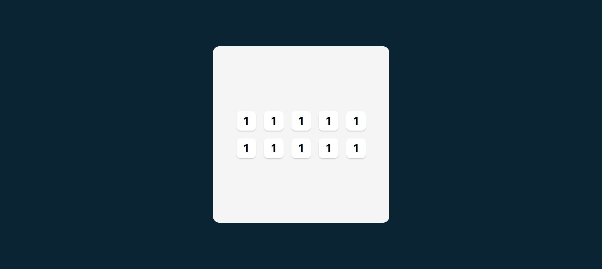
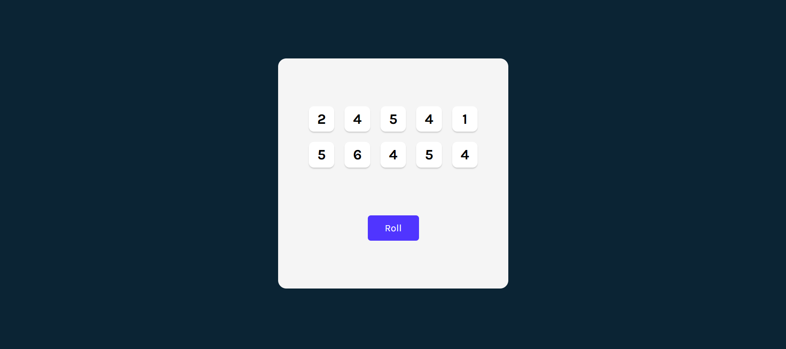
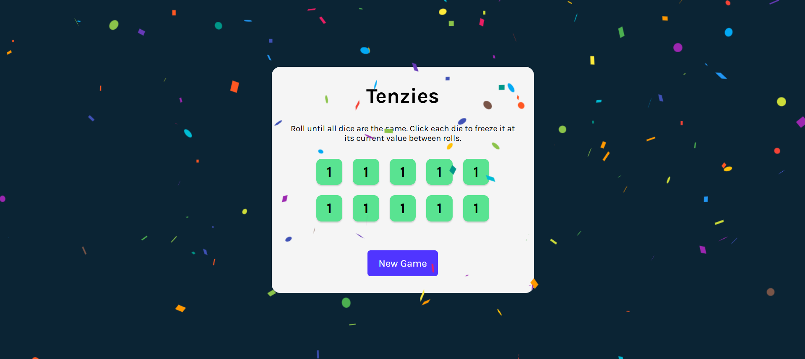
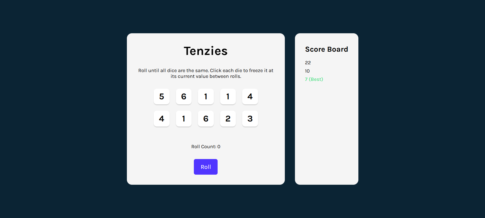

# 🎲 Tenzies Game (screenshots below)


A classic **Tenzies** implementation built entirely by hand with **live scoreboard**, **best-score highlighting**, and a cleaner component structure.

Live Link: https://tenzies-game-by-harshil.vercel.app/

NOTE: Everything in this project is written manually without AI-generated code. The focus was on mastering **state**, **mapping UI from data**, **component composition**, and state-driven UI effects like confetti, roll counters, and best-score logic.


## 🎯 Overview

Tenzies is a dice-rolling game where the objective is simple:

1. Roll dice  
2. Click dice to “hold” them  
3. Keep rolling until all ten dice show the same number  
4. Your roll count is saved into the scoreboard  
5. The best (minimum) number of rolls is highlighted automatically  

The app uses React to model every part of the game with clean, predictable state updates.

The whole project reinforced essential concepts:
- Working with arrays of objects in state  
- Mapping UI components from state  
- Memoized initializers for `useState`  
- Pure functions for generating new dice  
- Highlighting best scores via reduction logic  
- Updating nested state immutably  
- Conditional UI (confetti, button text, highlighting)  


## ✨ Features

- **10 randomly generated dice** (value, isHeld, id)
- **Toggle hold** by clicking a die
- **Roll only unheld dice**
- **Win detection** using `.every()`
- **Confetti animation upon winning**
- **Roll counter**
- **Scoreboard that logs every finished game**
- **Automatic best-score detection** using `.reduce()`
- **State stored as arrays of objects for real-world practice**
- **Fully componentized UI** (`Die.jsx`, `App.jsx`)


## 🧠 What I Practiced / Learned

### React State Management
- Multiple `useState` slices: dice, rollCount, scores  
- Lazy initialization: `useState(() => generateAllNewDice())`
- Complex updates with `.map()` and `.reduce()`
- Toggling boolean properties immutably
- Creating new arrays instead of mutating  
- Using `useEffect` to watch state changes  

### Component Design
- Reusable `<Die />` component  
- Passing callbacks down via props  
- Styling based on props (`isHeld` affects background)  

### JavaScript Logic
- Pure function for dice generation  
- Mapping an array → UI  
- Reducing array to find minimum object  
- Immutability and avoiding mutation traps  

### UI/UX Concepts
- Confetti feedback when the user wins  
- Disabled vs active game states (Roll vs New Game button)  
- Visual highlight for the best score  

This project is a perfect example of how **state drives UI**, not the other way around.


## 🧱 Tech Stack

- **React** (useState, useEffect, props, mapping lists)
- **Vite**
- **JavaScript (ES6+)**
- **nanoid** for unique IDs  
- **react-confetti** for celebration animation  
- **CSS Modules / Basic CSS** for component styling  


## 🖼️ Screenshots

### Base layout ready  


### Added die interactions  


### Roll button implemented  


### Confetti shown on win  


### Scoreboard fully implemented  



## 📁 File Structure

```text
src/
 ├─ assets/
 ├─ components/
 │   ├─ Die.jsx
 │   ├─ Die.css
 │   ├─ App.jsx
 │   ├─ App.css
 │   ├─ index.css
 │   └─ main.jsx
public/
 ├─ 1_baseReady.png
 ├─ 2_dieAdded.png
 ├─ 3_rollDiceButtonAdded.png
 ├─ 4_confettiAdded.png
 └─ 5_activeScoreBoardAdded.png
.gitignore
index.html
package.json
vite.config.js
README.md
```


## Running the Project Locally

Install dependencies:

```bash
npm install
```

Start development server:

```bash
npm run dev
```